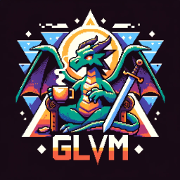

<p align="center">
  
</p>

# Game Loop Versatile Modules (GLVM)

This is my simple game engine for Linux and Windows OS's with both Vulkan and
OpenGL support. It's based on entity component system (ECS) with user friendly
C++ interface. Also it has partial support of `GLTf` and `Wavefront .obj` 3D
model formats. With GLVM you can make simple phong light of three types
(directional, spot, point). Very basic physics included (collisions, gravity).

## Linux

### Development libraries

* X11, Xi, XRandR;
* Vulkan;
* OpenGL;
* Alsa;
* PulseAudio.

### Repository specific

#### Gentoo

```bash
emerge --ask x11-libs/libX11 \
    x11-libs/libXi \
    x11-apps/xrandr \
    media-libs/vulkan-loader \
    dev-util/vulkan-tools \
    media-libs/mesa \
    media-libs/alsa-lib \
    media-sound/pulseaudio
```

#### Debian

```bash
apt install libx11-dev \
    libxi-dev \
    libxrandr-dev
    libgl1-mesa-dev \
    libasound2-dev \
    libpulse-dev \
    libudev-dev
```

#### Arch

```bash
pacman -S libxi \
    libxrandr \
    mesa \
    libglvnd \
    alsa-lib \
    pulseaudio
```

#### Fedora

```bash
dnf install libX11-devel \
    libXrandr-devel \
    libXi-devel \
    mesa-libGL-devel \
    alsa-lib-devel \
    pulseaudio-libs-devel \
    libudev-devel \
    libstdc++-static
```

## Windows

### Development libraries

* Vulkan;
* OpenGL.

### Specific tools

1. Install MSYS2:
    You can get it from official website (https://www.msys2.org/) or using
    `winget`:
    ```bash
    winget install MSYS2.MSYS2
    ```

2. Install the compiler and Vulkan libs:
    Inside MSYS2, for simpler way of installing packages, we need to install
    `pactoys`:
    ```bash
    pacman -S pactoys
    ```

3. Now we can use just shortened names of packages inside any MSYS2 toolchain:
    ```bash
    pacboy -S gcc:p
    pacboy -S vulkan:p
    ```

## Building GLVM

### Linux

Release  mode:

```bash
./tools/build.sh -r
```

Debug mode:

```bash
./tools/build.sh -d
```

### Windows

Release  mode:

```bash
tools\build.bat -r
```

Debug mode:

```bash
tools\build.bat -d
```

# License
Copyright © 2024 Maksim Manokhin a.k.a. Yuriorkis_Scream. Contacts: <fellfrostqtw@gmail.com>
